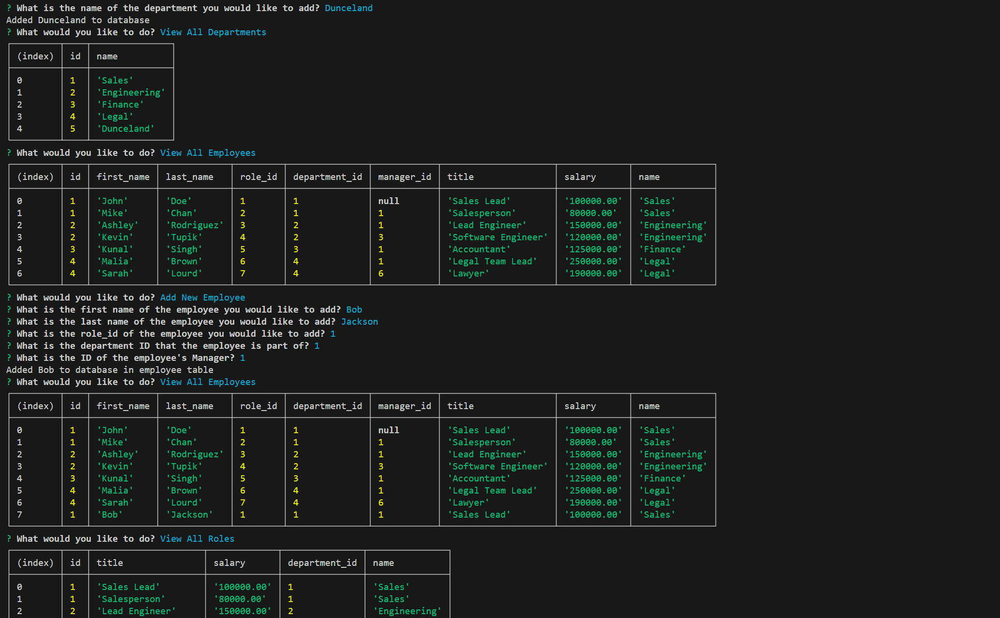

# Employee Tracker Database

## Description

This is a command-line application used for tracking employees with the jobs they do and the managers they serve.

## Table of Contents

- [Installation](#installation)
- [Usage](#usage)
- [License](#license)
- [Contributing](#contributing)
- [Tests](#tests)
- [Questions](#questions)

## Installation

Fork my Github Repository

## Usage

Track and add employees based on their jobs and what manager they serve.

## ScreenShot

## Demonstration

## License

https://opensource.org/licenses/MIT

This project is licensed under the MIT License.

## Contributing

n/a

## Tests

track employees and managers inside of a fully accessible command-line database

## Questions

If you have any questions about this project, you can reach me at orion.m.cannon@gmail.com
or you can find me on GitHub at [OrionC11](https://github.com/OrionC11).
